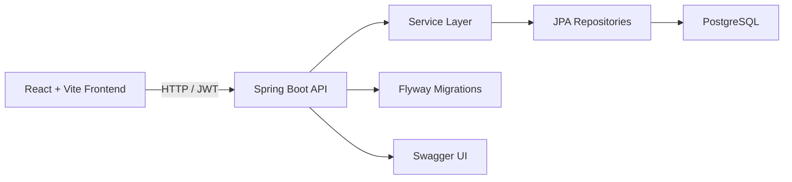

# GameVault

GameVault e uma biblioteca pessoal de jogos com autenticacao JWT, dashboard com estatisticas e catalogo visual para organizar a colecao de cada usuario.

O projeto combina um backend em Spring Boot com PostgreSQL e um frontend em React + TypeScript, com foco em portfolio, boa apresentacao visual e evolucao incremental de produto.

## Visao geral

Com o GameVault, cada usuario pode:

- criar conta e fazer login
- cadastrar jogos na propria biblioteca
- relacionar jogos com generos e plataformas
- marcar status como `wishlist`, `jogando`, `zerado` e `abandonado`
- salvar nota, review, horas jogadas, favorito e capa
- filtrar e ordenar o catalogo
- abrir a tela de detalhes de cada jogo
- visualizar estatisticas pessoais no dashboard

## Stack

### Backend

- Java 17
- Spring Boot 4
- Spring Security
- Spring Data JPA
- Flyway
- PostgreSQL
- Swagger / SpringDoc
- JUnit 5
- H2 para testes

### Frontend

- React 19
- TypeScript
- Vite
- Axios
- React Router
- Recharts
- Lucide React

### DevOps

- Docker Compose para o banco local
- GitHub Actions para CI de frontend e backend

## Funcionalidades implementadas

### Autenticacao

- registro de usuario
- login com JWT
- persistencia de sessao no frontend
- protecao de rotas e endpoints autenticados

### Biblioteca pessoal

- jogos vinculados ao usuario autenticado
- isolamento de dados entre usuarios
- cadastro de genero e plataforma
- cadastro de jogo com:
  - titulo
  - descricao
  - data de lancamento
  - nota
  - status
  - favorito
  - review
  - horas jogadas
  - URL de capa

### Catalogo

- busca por titulo
- filtros por status, genero, plataforma e favorito
- ordenacao por titulo, nota, lancamento e horas jogadas
- cards com capa e estado vazio
- modal de detalhes do jogo

### Dashboard

- total de jogos
- total de generos
- total de plataformas
- media de notas
- total de favoritos
- total de horas jogadas
- jogos por plataforma
- jogos por status
- top jogos por nota

## Arquitetura



### Estrutura do backend

```text
src/main/java/dev/matheus/gameVault/
  config/        seguranca, JWT e configuracoes da aplicacao
  controller/    endpoints REST
  entity/        entidades JPA
  mapper/        conversao entre DTOs e entidades
  repository/    acesso a dados
  service/       regras de negocio
  exception/     excecoes customizadas
```

### Estrutura do frontend

```text
frontend/src/
  components/    componentes reutilizaveis
  contexts/      autenticacao e estado global
  pages/         login, registro, dashboard e catalogo
  services/      cliente HTTP
  styles/        estilos globais e por pagina
```

## Como rodar localmente

### Requisitos

- Java 17+
- Node.js 20+ ou 22+
- Docker Desktop / Docker Compose

### 1. Subir o banco

```bash
docker compose up -d
```

O PostgreSQL sobe em `localhost:5433` com:

- database: `gamevault`
- user: `postgres`
- password: `postgres`

### 2. Rodar o backend

Linux/macOS:

```bash
./mvnw spring-boot:run
```

Windows:

```bash
mvnw.cmd spring-boot:run
```

Backend disponivel em: [http://localhost:8080](http://localhost:8080)

### 3. Rodar o frontend

```bash
cd frontend
npm install
npm run dev
```

Frontend disponivel em: [http://localhost:5173](http://localhost:5173)

## Conta para demonstracao local

Para visualizar a interface com dados preenchidos, voce pode usar:

- email: `matheus@email.com`
- senha: `12345`

## Endpoints principais

### Autenticacao

- `POST /gamevault/auth/registrar`
- `POST /gamevault/auth/login`

### Jogos

- `GET /gamevault/jogo`
- `GET /gamevault/jogo/{id}`
- `GET /gamevault/jogo/estatisticas`
- `POST /gamevault/jogo`
- `PUT /gamevault/jogo/{id}`
- `DELETE /gamevault/jogo/{id}`

### Catalogos auxiliares

- `GET /gamevault/genero`
- `POST /gamevault/genero`
- `DELETE /gamevault/genero/{id}`
- `GET /gamevault/plataforma`
- `POST /gamevault/plataforma`
- `DELETE /gamevault/plataforma/{id}`

## Documentacao da API

Com a aplicacao rodando, o Swagger fica disponivel em:

- [http://localhost:8080/swagger-ui.html](http://localhost:8080/swagger-ui.html)

## Testes e qualidade

### Backend

```bash
./mvnw test
```

ou no Windows:

```bash
mvnw.cmd test
```

### Frontend

```bash
cd frontend
npm run lint
npm run build
```

## CI com GitHub Actions

O projeto possui pipelines separados:

- `.github/workflows/backend-ci.yml`
- `.github/workflows/frontend-ci.yml`

Eles executam:

- backend: testes Maven
- frontend: `npm ci`, lint e build

## Configuracao atual

Arquivo principal de configuracao do backend:

- [application.yaml](src/main/resources/application.yaml)

Hoje o projeto usa:

- PostgreSQL local em `localhost:5433`
- Flyway habilitado
- secret JWT configurado localmente no arquivo de aplicacao

Para ambiente de producao, o proximo passo recomendado e mover esse secret para variavel de ambiente.
