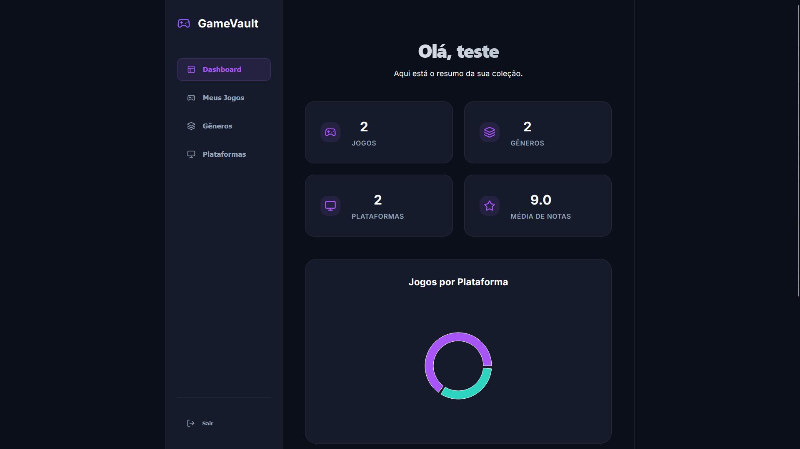

# GameVault

API REST para cadastro de catálogo de Genero e Plataformas de Jogos, desenvolvida com Java e Spring Boot, agora com interface visual moderna em React.


## Sumário

- [Sobre o projeto](#sobre-o-projeto)
- [Tecnologias](#tecnologias)
- [Arquitetura](#arquitetura)
- [Funcionalidades](#funcionalidades)
- [Interface Visual](#interface-visual)
- [Testes](#testes)
- [Configuração](#configuração)
- [Passo a Passo](#passo-a-passo)
- [Documentação da API](#documentação-da-api)
- [Endpoints](#endpoints)

## Sobre o projeto

Plataforma que permite aos usuários descobrir jogos disponíveis em diferentes plataformas. O projeto foi desenvolvido com foco em:

- Organização de conteúdo: categorização eficiente de Jogos
- Múltiplos serviços: integração com diversas plataformas de jogos
- Segurança: autenticação JWT para proteção dos endpoints
- Experiência do Usuário: interface intuitiva com dashboard de estatísticas

## Tecnologias

### Backend


[](#)


### Frontend


## Arquitetura

O projeto segue arquitetura em camadas:

`src/main/java/com/gameVault/`
- `config/` — Configurações do Spring e Security
- `controller/` — Controllers REST
- `entity/` — Entidades JPA
- `repository/` — Repositórios Spring Data
- `service/` — Regras de negócio
- `exception/` — Exceções customizadas
- `mapper/` — Conversão entre DTOs e entidades

## Funcionalidades

Autenticação e autorização
- Login e registro de usuários via interface e API
- Autenticação JWT com expiração de 24h
- Proteção de rotas e persistência de sessão

Gerenciamento de generos
- CRUD completo de generos de jogos
- Interface dedicada para gestão rápida

Serviços de plataformas
- Cadastro e gestão de provedores (PC, PS5, Xbox, etc)
- Associação dinâmica com jogos

Catálogo de Jogos
- Cadastro detalhado com notas e datas
- Busca em tempo real por título
- Dashboard com gráficos de distribuição por plataforma

## Interface Visual

O frontend foi desenvolvido em React com TypeScript, oferecendo:
- **Dashboard:** Visão analítica da coleção com gráficos interativos.
- **Catálogo:** Grid moderno de cards com busca integrada.
- **Gerenciamento:** Modais intuitivos para cadastros de Jogos, Gêneros e Plataformas.
- **Design:** Tema dark "Gamer Premium" com efeitos de Glassmorphism.

## Testes

O projeto conta com uma suíte de testes automatizados garantindo a confiabilidade:
- **Testes Unitários:** Foco na camada de serviço utilizando JUnit 5 e Mockito.
- **Testes de Integração:** Validação de fluxos completos (Controller -> Service -> Repository) utilizando banco de dados H2 em memória.
- **Cenários Cobertos:** Autenticação, criptografia de senhas, regras de negócio de jogos e persistência.

## Configuração

### Requisitos
- Java 17 ou superior
- Node.js 18 ou superior
- Docker e Docker-compose

### Passo a passo

1. Clone o repositório:
```bash
git clone [url-do-repositorio]
```

2. Subir o Banco de Dados (Docker):
```bash
docker-compose up -d
```

3. Iniciar o Backend:
```bash
./mvnw spring-boot:run
```

4. Iniciar o Frontend:
```bash
cd frontend
npm install
npm run dev
```

A API ficará disponível em `http://localhost:8080` e o Frontend em `http://localhost:5173`.

## Documentação da API

Para testar a API, acesse o Swagger em:
```
http://localhost:8080/swagger-ui.html
```

### Endpoints Principais

- `POST /gamevault/auth/registrar` — Criar nova conta
- `POST /gamevault/auth/login` — Autenticar usuário
- `GET /gamevault/jogo` — Listar catálogo completo
- `POST /gamevault/jogo` — Cadastrar novo jogo
- `GET /gamevault/genero` — Listar gêneros disponíveis
- `GET /gamevault/plataforma` — Listar plataformas disponíveis
